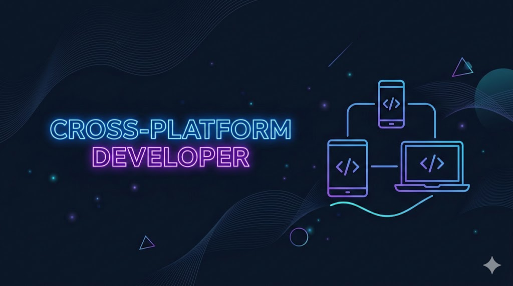

# 🚀 Hola, soy Izan Valverde | Multi-platform Developer

  

---

### 💫 Sobre mí
Estoy dando mis primeros pasos en el fascinante mundo del **desarrollo multiplataforma**. Mi objetivo es crear experiencias fluidas y potentes que funcionen en cualquier dispositivo desde un solo código base.

* 🌱 Actualmente aprendiendo: **Flutter / React Native / .NET MAUI** (Elige tu preferido).
* 🎯 Meta para 2026: Publicar mi primera app en Play Store y App Store.
* ⚡ Dato curioso: Me encanta cómo el código puede cobrar vida en un teléfono y una PC al mismo tiempo.

---

### 🛠️ Mi Stack Tecnológico

| Área | Tecnologías |
| :--- | :--- |
| **Lenguajes** |    |
| **Frameworks** |   |
| **Herramientas** |    |

---

### 📊 Actividad de GitHub

  
  

---

### 🤝 Conectemos
¿Tienes algún consejo para un principiante o quieres colaborar en un proyecto?

---

  <i>"Escribe una vez, ejecuta en todos lados."</i>

Antoño